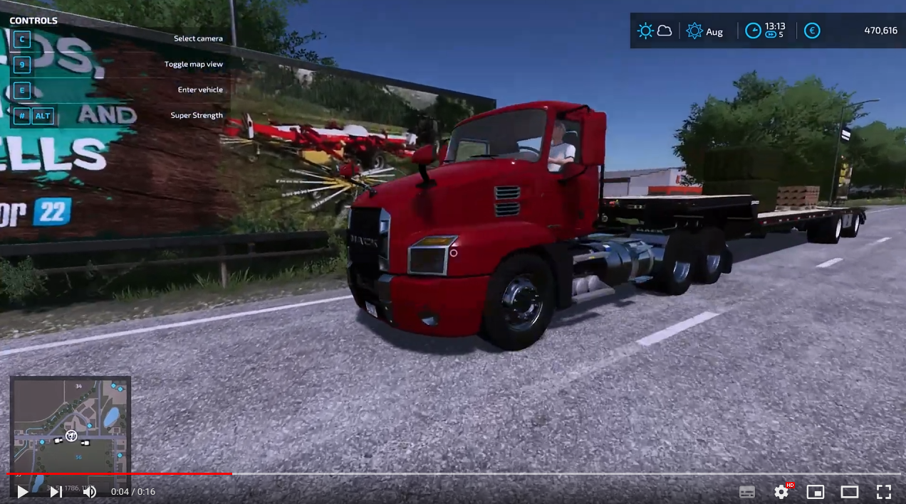
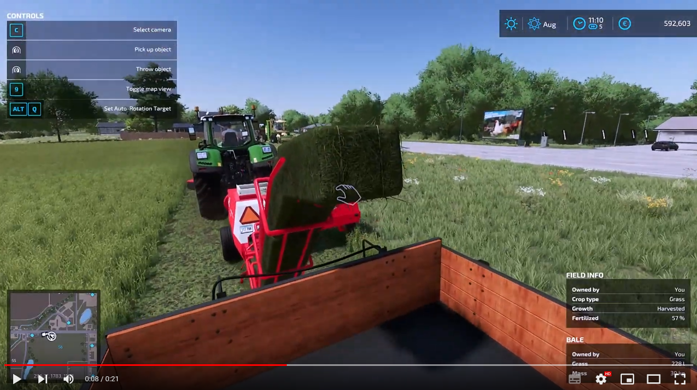

# FS25_StickyFeet

## Mod description

If you stand on a vehicle which is driving, this mod will make your feet stick to it, so you don't slide off.

This is an early release for single player only. It fully works apart from jumping while moving with the vehicle.
Streamers can use it for unique camera angles (in first person) and players can already have some fun while the AI is driving.

Note that with this mod active, the player will no longer be considered an obstacle by the AI, so AI helpers will just pick you up and carry you along if you are in their way.

## Videos

These videos are from FS22, but the general idea is the same:

## How to install

1. Download the newest zip from the [Releases page](https://github.com/Timmeey86/FS25_StickyFeet/releases)
1. Place the zip file in your FS25 mod folder
1. Start the game and use like any other mod

## How to debug/code

1. Obviously, own a copy of Farming Simulator 25
1. Clone this folder anywhere
1. Use Visual Code with at least the Lua Language Server Plugin for coding
1. When testing, execute copytofs.bat and open that mod folder in Giants Studio
1. Debug in Giants Studio or just start the game and use console commands
